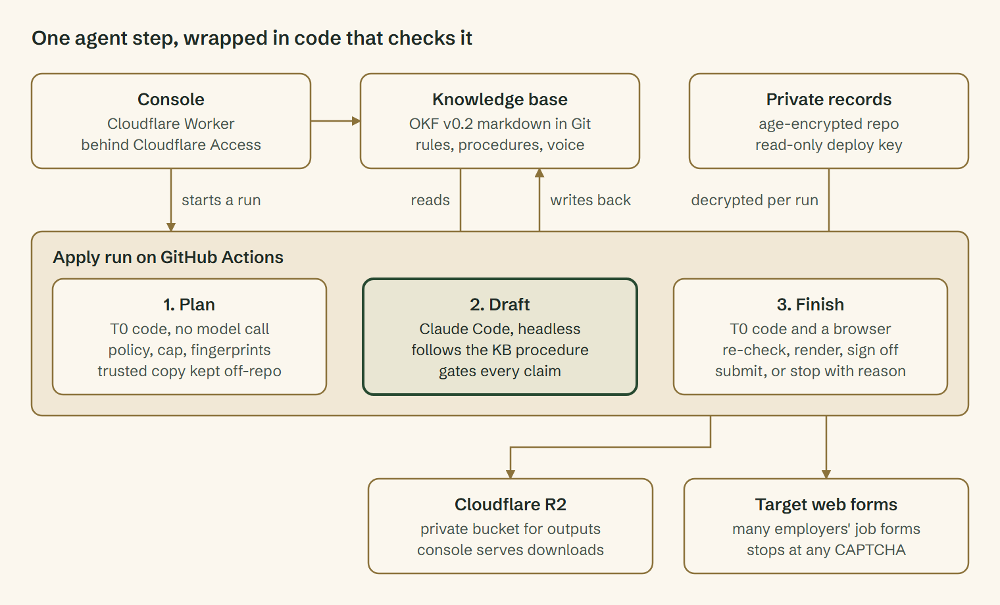
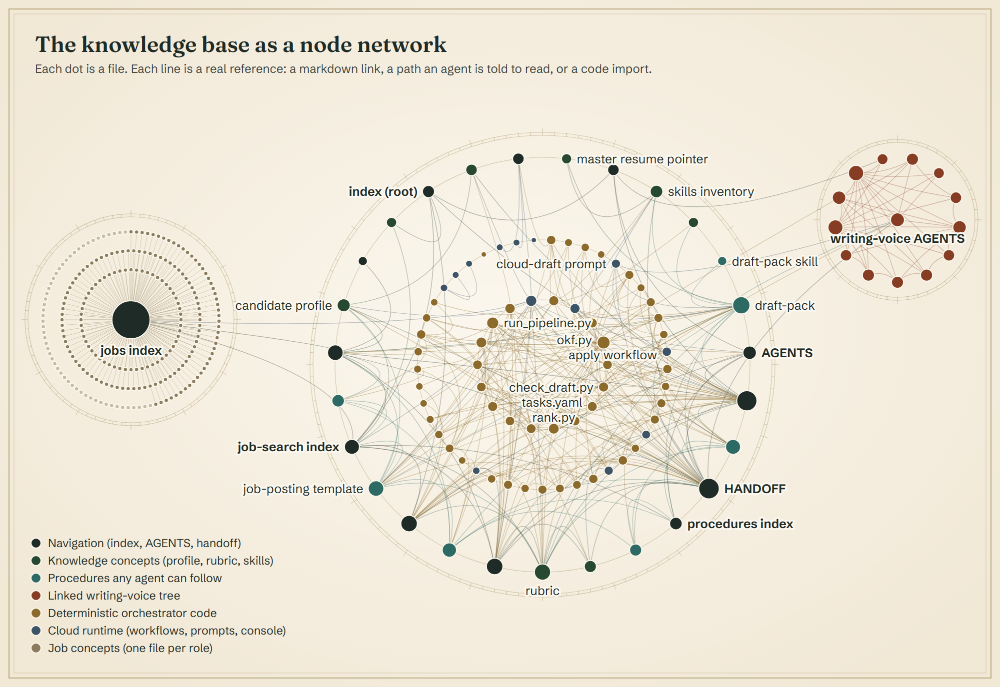

# Building a Governed AI Agent on an Open Knowledge Base

M Walker · 27 September 2026

[Website portfolio](https://www.markuswalker.com/projects/governed-ai-agent/) · [Download the website edition (PDF)](docs/governed-ai-agent.pdf)

I designed and built a custom AI agent that runs in the cloud, draws everything it knows from an open knowledge base, and can only act inside policy written as code. I tested it on a live, high-stakes domain: my own job search.

## At a glance

In its first nine days the system tracked 234 roles and logged 8,782 deterministic decisions at zero model cost. All 208 automated tests pass. It runs entirely in the cloud: a person presses Run in a web console, and the agent works inside rules it cannot change.

| Layer | Technology | What it does |
| --- | --- | --- |
| Knowledge base | Open Knowledge Format (OKF) v0.2 markdown in a private Git repo | The agents' memory, rules, procedures and evidence |
| Control plane | Cloudflare Worker behind Cloudflare Access | Human console to triage, approve and start runs |
| Execution runtime | GitHub Actions, one workflow per job | Serverless runs, started once and then gone |
| Agent | Claude Code, headless, with an allowlist of tools | Drafts written work by following a procedure stored in the knowledge base |
| Deterministic core | Python orchestrator, about 9,300 lines plus 3,100 lines of tests | Filtering, ranking, policy checks, rendering, sign-off, submission |
| Private records | age-encrypted repo, read-only deploy key, Cloudflare R2 for outputs | Personal data is never stored in plain text |
| Browser automation | Playwright with headless Chromium | Completes web forms on four applicant tracking systems where the site permits automation. It stops at a CAPTCHA. |

## My role

I owned it end to end, from problem framing through to production: architecture, knowledge base design, policy rules, security model, deployment and the run book. I built it hand in hand with AI coding agents. I wrote and changed code myself, curated the knowledge base directly, and shared the implementation with the agents, setting the acceptance criteria for each milestone and reviewing every result before moving on. I deployed it to the cloud myself, and it runs live today on Cloudflare and GitHub Actions, doing real work on a real problem.

## What it demonstrates

- **Agent design.** One bounded agent step inside deterministic code, with a tool allowlist and no credentials of its own.
- **Knowledge engineering.** An OKF v0.2 knowledge base that the agent, the code and people all read from one record.
- **AI governance.** Policy as code, human holds, a truthfulness gate on every claim, and Git history as the audit trail.
- **Cloud security.** Zero-trust access, a least-privilege token, encryption at rest and controls against prompt injection.
- **Cost engineering.** A tiered model cascade that keeps most decisions at zero tokens.
- **Delivery.** Serverless control plane, CI/CD on GitHub Actions and 208 automated tests.

## Architecture

The model does one step. Deterministic code plans before it and re-checks after it, and only that code can send anything.

The console writes each human decision into the knowledge base. A run reads the base, plans in code, lets one agent draft, then re-checks everything in code before any output leaves. Private records exist in plain text only on the runner's disk, only for the run.

## The knowledge base is the agent's brain

The agent is not steered by a long prompt. Its prompt is about 40 lines, and most of those lines point it at files in the knowledge base. What it knows, what it may claim, how it should write and which steps it follows all live as plain markdown that people, code and any vendor's agent can read.

The base follows Google Cloud's [Open Knowledge Format](https://github.com/GoogleCloudPlatform/knowledge-catalog/blob/main/okf/README.md) (OKF) v0.2: one fact per markdown file (a "concept"), each with a YAML header. An agent starts at `index.md`, reads the bundle's index, then opens only the concepts the task needs. It never ingests the whole repository.

Each dot is a file. Each line is a real reference: a markdown link, a path an agent is told to read, or a code import. The 234 role concepts fan out from the jobs index. The code sits in the middle and reaches outward to the knowledge and procedure concepts it reads. The writing-voice tree is a separate knowledge base, linked in read-only.

| Part of the base | What it holds | How the pipeline uses it |
| --- | --- | --- |
| Job concepts | One file per role, 234 so far, with fit, rank and application state in the header | Code reads and writes the header. The agent reads the body. Both work from one record. |
| Procedure concepts | Step lists such as `draft-pack.md`, written for any agent | The Claude Code skill is a ten-line pointer to the procedure. Swap the engine and the procedure still works. |
| Rubric concept | Scoring weights and the qualification policy, in its header | Code enforces it. A policy change is a one-line markdown edit, reviewed in Git like code. |
| Skills inventory | Every skill with a level and the source file that evidences it | The truthfulness gate checks every draft against it. Any claim traces back to evidence. |
| Candidate profile | Preferences, targets and engineering ethos | Ranking reads the preferences. Drafting reads the ethos. |
| Linked writing-voice tree | A read-only mirror of a separate voice knowledge base | The agent reads its rules before writing any prose. One voice, reused across projects. |
| `AGENTS.md`, `log.md`, `HANDOFF.md` | Navigation rules, dated change logs, where the last session stopped | Any agent on any platform can pick up the work cold. |

Three rules keep the base trustworthy:

- **Human-owned fields are never overwritten.** A decision a person recorded on a concept stays. Code carries it as a hold that no policy overrides.
- **Private data stays out.** The master resume and personal answers live in a separate encrypted records tree. The base holds only the path to them.
- **Names are redacted on ingestion.** Employer and client names are swapped for placeholders before anything enters a tree, and the build refuses to write a tree if a listed name survives.

OKF v0.2 added optional [trust signals](https://cloud.google.com/blog/products/data-analytics/okf-v0-2-adds-trust-signals/): provenance, who generated versus who verified a concept, freshness and lifecycle status. The base already uses `generated` and `status`, and the skills inventory's per-skill source column is provenance in practice.

## Cost-aware routing

Plain code handles everything it can, and a model is called only for work that code cannot do. Every task is declared once in `tasks.yaml` with a cost tier, a ceiling it may never cross, a validator that must pass and a named rule for escalating. The design follows the FrugalGPT cascade idea.

| Tier | Engine | Tasks it owns |
| --- | --- | --- |
| T0 | Deterministic Python | Normalise, dedup, hard filters, work-mode grouping, ranking, qualification policy, planning, re-checks, rendering, sign-off, submission |
| T1 | Haiku | Quality flags such as ghost listings and recruiter spam (ladder parked for now) |
| T2 | Sonnet | One fit assessment per new role, and drafting every pack |
| T3 | Opus | Reserved for polishing top-group documents, never escalates further |

The run ledger shows the effect. Across nine days it logged 8,782 T0 decisions at zero tokens. A model only sees a role after code has filtered and ranked it, and only once.

## Governance: policy as code

No role moves forward because a model thought it should. It moves because it passed explicit tests that live in the rubric, and a person can read and change every one of them.

- **Qualification is policy.** A role must be confirmed remote, a strong or good fit, on a supported form, not an excluded employer and not flagged as a ghost or spam listing. The rule is a few lines of YAML in `rubric.md`.
- **Human decisions win.** Skip and Maybe are holds no policy can override. A role that fails any test is shown in the console with its reasons, never dropped silently.
- **Gates are code.** A draft that names a tool, employer or number the evidence does not contain fails `check_draft.py`. The agent gets four attempts, then the role stops and the gap is written down.
- **The daily cap cannot leak.** Slots are counted on the selection stamp, so cancelling a picked role never hands its slot back. A second count on actual submissions stops carried-over roles pushing a day past the cap.
- **Every run is on the record.** Each concept records who decided and when, each stop records its reason, and each run commits its results to Git, so history is the audit trail.

## Security design

The agent is treated as an untrusted component that reads untrusted text. Every threat below has a control in code.

| Threat | Control |
| --- | --- |
| Text scraped from a web page carries an injected instruction that redirects a submission | Planning fingerprints 12 fields per role (employer, URLs, form type, decision, group, fit) with SHA-256. The trusted copy sits outside the repo, where the agent is not pointed. Finish refuses any role whose fingerprint changed. |
| The drafting agent pushes, uploads or reaches the network | The agent's checkout has no push credentials. Its tools are an allowlist: read, write, edit, search and one checker script. It holds no Git, storage or cloud token. |
| Personal data leaks at rest | Records are encrypted with age in a separate repo, fetched with a read-only deploy key, decrypted to the runner's disk for the run, then removed. The key file is shredded straight after use. |
| Someone else drives the console | Cloudflare Access in front, and the Worker verifies the Access token itself: signature, audience, issuer, expiry, then an email allowlist. Writes must be same-origin JSON. A strict content security policy blocks injected script. |
| An over-scoped platform token | One fine-grained token, one repository, only the permissions each call needs. It lives in the Worker as a secret and never reaches the browser. |
| An approved document changes before it is sent | Sign-off stores a SHA-256 hash of every file. Submission refuses if any file differs. |
| Two runs write at once | Runs share a concurrency group, the console refuses a second run while one is queued, and commits retry with a rebase that keeps the run's own record. |

## Engineering evidence

The suite runs 208 tests and all pass. They cover the parts that carry risk: the policy gates, the truthfulness checker, the voice linter, the plan and finish loop, the submit guards and the ad fetcher, using fixture job files and saved copies of real application forms.

From the first live cloud run, on 27 September 2026:

- Planning selected and carried five roles in about a second.
- The agent drafted all five packs, and every one cleared the claim and voice checks within its attempt limit.
- The first start failed with a 403 from the platform. The console named the status, the cause was a token missing the one permission that starts workflows, and the fix was a single permission with no redeploy.

## Lessons and where the pattern goes next

The biggest lesson was to move knowledge and policy out of the prompt and into files. The prompt shrank to a pointer, the rules became reviewable in Git, and the engine became swappable.

- **The model drafts.** Code decides, checks and acts.
- **Make autonomy a policy.** Rules, caps and holds are data a person can read and change in one line.
- **Design for the unattended run.** Every stop records its reason, because nobody is watching when it happens.

Next steps for the pipeline:

- Add a minimum score and a full-ad requirement to the policy.
- Switch on the parked critic pass, a cheap model grading each draft before it can go out.

The same pattern fits any workflow where agents must act on regulated or high-stakes work: compliance evidence packs, supplier risk assessments, incident reports. Each needs the same four things: a governed knowledge base, cheap deterministic routing, graded autonomy and a full audit trail.

## Sources

- [Open Knowledge Format README](https://github.com/GoogleCloudPlatform/knowledge-catalog/blob/main/okf/README.md), Google Cloud
- [OKF v0.2 adds trust signals](https://cloud.google.com/blog/products/data-analytics/okf-v0-2-adds-trust-signals/), Google Cloud Blog, 24 July 2026
- [FrugalGPT: How to Use Large Language Models While Reducing Cost and Improving Performance](https://arxiv.org/abs/2305.05176), Chen, Zaharia and Zou, 2023

Figures come from the project's own repository, test run and run ledger as of 27 September 2026.
